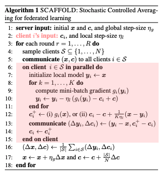

## Data Preprocessing

a) IID Data scenario :  Each model was trained on a equal share of all the classes in the dataset.

b) Non-IID Data scenario:  
We simulate the non-IID data distribution using the following logic: 
    client_a : (labels == 'T-Shirt/top') | (labels == 'Trouser') | (labels == 'Pullover')
    client_b : (labels == 'Dress') | (labels == 'Coat')
    client_c : (labels == 'Sandal') | (labels == 'Shirt')
    client_d : (labels == 'Sneaker') | (labels == 'Bag') | (labels == 'Ankle Boot')

## Model Development

We used the following Convolutional Neural Network for all the clients and the community model :  
      
      
       _________________________________________________________________
       Layer (type)                Output Shape              Param #   
       =================================================================
       
       fashion (InputLayer)        [(None, 28, 28, 1)]       0         
                                                                       
       conv2d_240 (Conv2D)         (None, 24, 24, 128)       3328      
                                                                       
       max_pooling2d_240 (MaxPool  (None, 12, 12, 128)       0         
       ing2D)                                                          
                                                                       
       conv2d_241 (Conv2D)         (None, 6, 6, 128)         802944    
                                                                       
       max_pooling2d_241 (MaxPool  (None, 3, 3, 128)         0         
       ing2D)                                                          
                                                                       
       flatten_120 (Flatten)       (None, 1152)              0         
                                                                       
       dense_120 (Dense)           (None, 512)               590336    
                                                                       
       predictions (Dense)         (None, 10)                5130      
                                                                       
      =================================================================
      Total params: 1401738 (5.35 MB)
      Trainable params: 1401738 (5.35 MB)
      Non-trainable params: 0 (0.00 Byte)
      _________________________________________________________________

We used Keras wrapper on Tensorflow for implementing the models. For visualization we stuck to Matplotlib and Seaborn.

For the scaffold model, each model was also equipped with client control variate for each layer to adjust for the drift. Since we had the architecture of our model fixed before hand, we could keep the vector structures of the control variates also the same as the layer weights.
      
      class ControlVariate():
        def __init__(self):
          self.conv1_c = tensorflow.zeros((5,5,1,128))
          self.conv2_c = tensorflow.zeros((7,7,128,128))
          self.flatten1_c = tensorflow.zeros((1152,512))
          self.flatten2_c = tensorflow.zeros((512,10))
          self.pred_c = tensorflow.zeros((10,))

We implemented the suggestions laid down by the SCAFFOLD Paper with each mini-batch train step as mentioned in the algorithm outlined in the paper. 

## Model Evaluation

### a) Evaluation of performance :  
The evaluation dataset has 10000 instances of all classes to test how the clients perform on the global dataset. This enables to check if the knowledge has been transferred merely through weight transmission. 

### b) Evaluation of client drift: 
The objective of this metric was to measure the client drift. We wanted to answer the question : how to visualize the drift of a model from it's optima? The model output is the function of the weights of the model. We take the softmax output of the last layer of the client and we extract two probability distributions: one before the local training (after the weights are distributed from the community model) and one after the local training. We then measure the KL Divergence of the two probability distributions to see how much the output distribution varies from the community model. This is essentially the catastrophic forgetting described in the earlier sections. Interesting, this is also problem in Transfer Learning: how much of the pre-trained knowledge is lost in the fine-tuning but in the case of transfer learning, it's core purpose and evaluation metrics lies in domain of the finetuned data. We don't worry that much about the pre-trained knowledge.

### c) Visualization of the class clustering:
Within the dataset, certain instances pose significant challenges. To define this difficulty, consider the scenario where a shirt and a pullover exhibit remarkable similarity. The model must discern subtle distinctions between them. Our aim was to visually represent this clustering by examining the neural network's weight. Following each round, we fed a segment of the validation dataset through the network, capturing the activations from the final Dense layer of the CNN. We then reduced the dimensionality from 512 to 2 using t-SNE and plotted the resulting points after each round. The animated visualizations can be found in the Results section.

