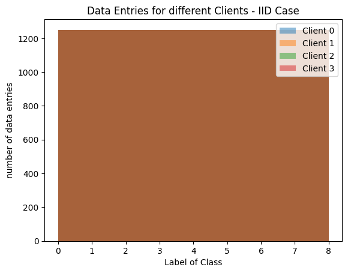
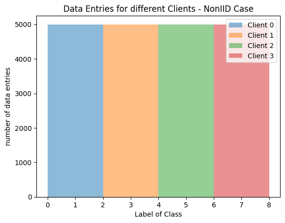

## Introduction

Since we were dealing with a very fundamental issue, we picked a very simple dataset to first reproduce the issue and later research ways on how to fix it.

## Data Overview and Examples

We used the Fashion mnist dataset for this problem statement. We also tried to run the system with Cifar-10 dataset. Despite being fairly simplistic in nature, these datasets can be engineered to get a non-IID and IID fractions. Very simply put, IID stands for data that comes from independent, identically distributed dataset. Non-IID is the exact opposite of that. This dataset doesn't share a common distribution. In real life Machine Learning problem statement, the dataset is predominantly Non-IID and also we generally don't know the true underlying distribution of the data. So it is very important that we truly understand this problem and make attempts to solve it.  

| IID                    | Non-IID              |
| ---------------------- | ---------------------- |
|  |  |

This is simply how we simulate IID and Non-IID dataset from Fashion Mnist data.
