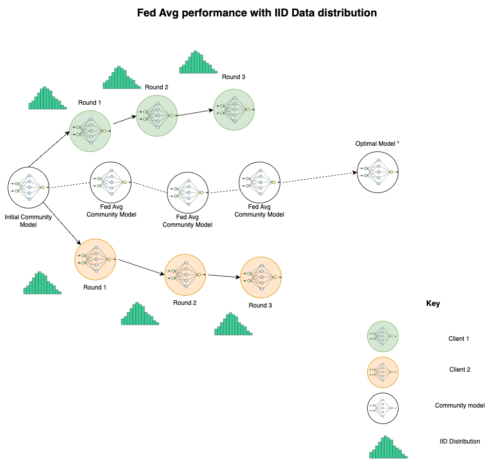
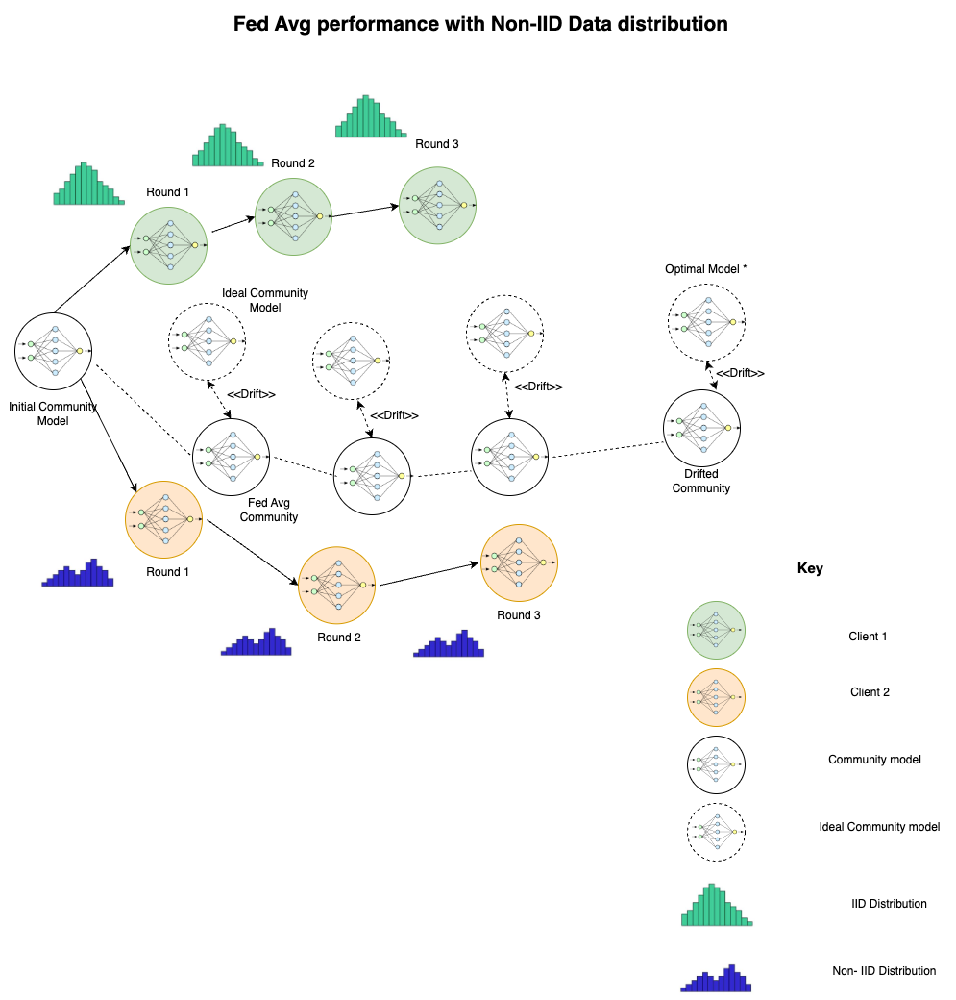

## Introduction

Federated Learning originates from the rising concerns about data privacy and the constraints of conventional centralized machine learning approaches. It emerged as a solution to safeguard user privacy while leveraging the wealth of knowledge found in dispersed data sources.

Industries increasingly embraced this concept upon realizing its potential for cooperative learning within the bounds of data privacy regulations. Its rapid evolution owes much to progress in encryption methods, communication protocols, and decentralized optimization algorithms. Presently, Federated Learning represents an encouraging framework that facilitates collaboration among diverse entities, prioritizing the protection of confidential user information and driving advancements in privacy-focused machine learning.

## Motivation

Prof. Abram wanted us to address a very specific scenario. In the original Fed avg. paper, there is a recommendation put forward that the weights from the community be overwritten at the local client site. Now consider the example of a hospital with multiple sites and there is a model that predicts a condition based on certain characteristics. This case can be Non-IID in the sense that a form of condition might have never been encountered at a site. If we can use federated learning to solve this problem, then the sensitivity of the patient's privacy at a differnt client is maintained and the characteristics are learnt without any network overhead. But in Non-IID case, there is catastrophic forgetting at the client level. The task completely pulls the community weights in the direction of the local minima!

Under IID conditions,  
  

Under Non-IID conditions,  

Our motivation for the semester was two folds : First, to understand the drift of the community model and second to visualize and understand the catastrophic forgetting exhibited by the client models.

## Problem for the Semester

For the semester, we had two simple goals : To establish a working federated learning network - a problem statement rooted in Engineering and the second one was to visualized how the clients drifted - to answer the question : how does one quantify this drift?

## State of the Art

We initially sought to reproduce and test the network proposed in <a href = "https://iopscience.iop.org/article/10.1088/1361-6501/acf7da/meta">FedSiM</a>. We shall report the findings in the subsequent sections. We were also fascinated by the amazing math based proof for fixing client drifts in <a href = "https://proceedings.mlr.press/v119/karimireddy20a.html">SCAFFOLD: Stochastic Controlled Averaging
for Federated Learning</a> and wanted to implement the paper's proposed system.

## Design and Approach

Though initially framed as an engineering problem, at its essence, this constituted a research project aimed at exploring and executing various academic papers to evaluate their effectiveness. Consequently, we implemented two noteworthy papers over the semester to analyze and observe their outcomes.
 
(1) For FedSiM paper : We built a network of Convolution Neural Networks(clients) and a Community model. Like it is proposed in the paper, we manipulated each neuron in every layer of the network with a small value to observe its overall impact on the output of the network.
 
(2) For the SCAFFOLD paper : We built a Federated network of convolutional neural networks and a community model. Each model was equipped with a client control variate as proposed in the paper to account and adjust for the client drift.
