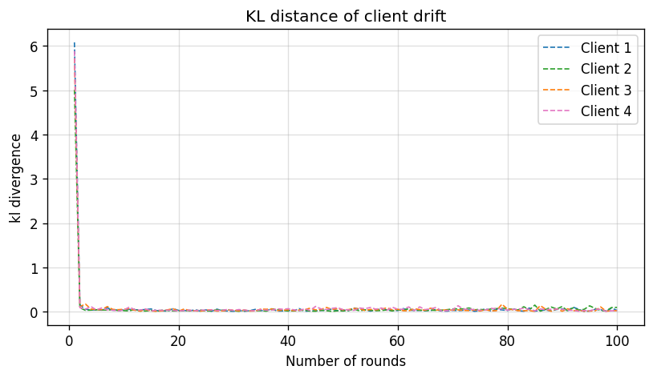
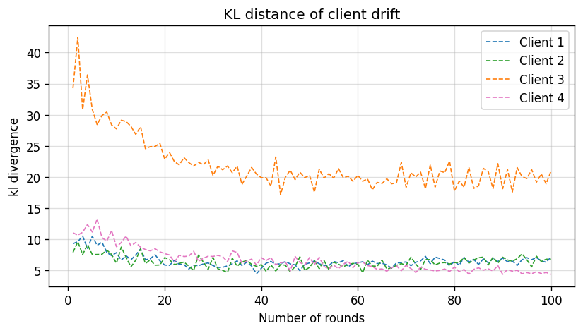
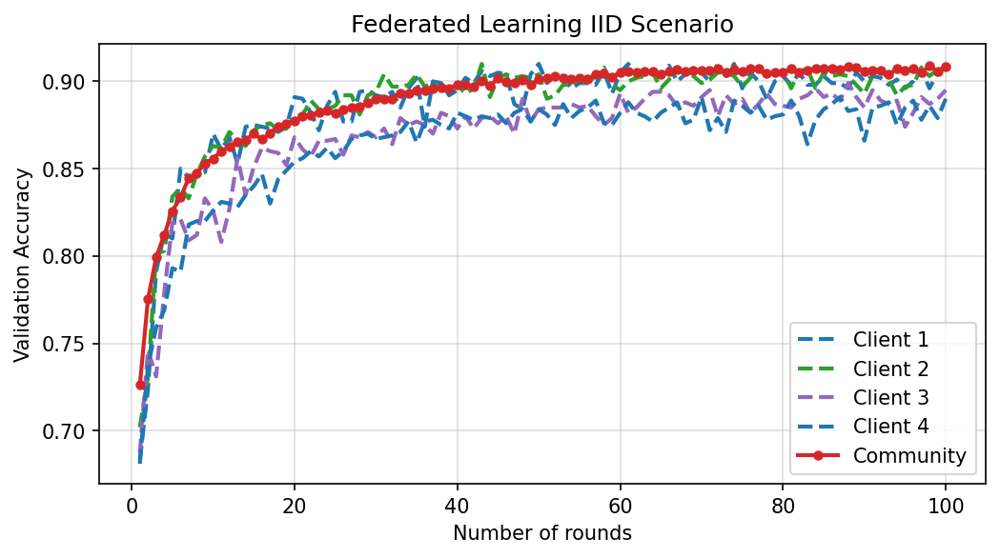
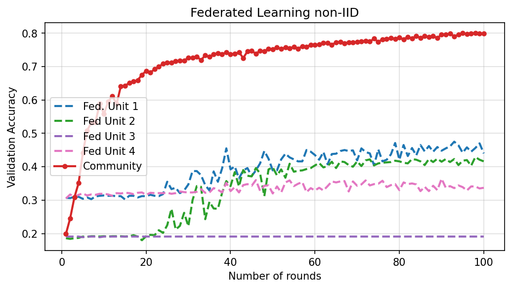
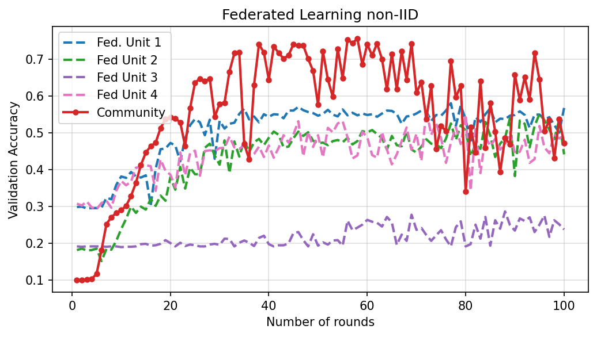
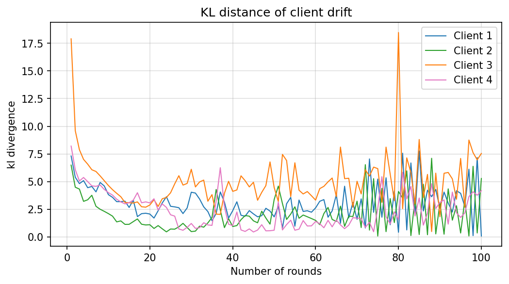

## Visualization of the last layer of the model 

So how does the softmax layer give out the classes to be predicted. It takes the activations from the last layer of the model. We took a specific class-balanced subset of the test dataset and pulled out the activations from the last layer of the model. After reducing the dimension of the activation for an instance to 2 using t-SNE, we plotted the each instance colored by its target label. If the classes are placed well apart, it visually shows that even in two dimensions, these class clusters can be separated. Not a very accurate way but makes up for a visual. After all, we are very visual beings. :)

| IID                    | Non-IID              |
| ---------------------- | ---------------------- |
|  |  |

As the rounds proceed, there is clear separation in the IID-cases but in the non-IID case, there is still a lot of overlap. 

## KL Divergence

KL Divergence can show the disimilarity between two probability distributions. The final output is the function of the weights of the models. So we propose using KL Divergence as a measure of the catastrophic forgetting happening at the client sites. Specifically, KL Divergence between the probability distributions obtained from the community model and the local model after a round of finetuning is taken. A low divergence score is a good thing!

| IID                    | Non-IID              |
| ---------------------- | ---------------------- |
|  |  |

## Validation accuracy plots 

We plotted the validation set accuracy for the community model as well as the clients. For the clients, the validation set contains all the classes and not just the classes it has in its local site.

| IID                    | Non-IID              |
| ---------------------- | ---------------------- |
|  |  |

This plot essentially brings out the two issues we are trying to address. First, the validation accuracy of the community model is off by 10% in case of Non-IID data, which shows a drift in the community model. Second, the local clients never do that well on the validation set! It has poor accuracy. These are the two issues we sought to visualize and fix, if possible!

## Scaffold 
Scaffold addresses the issue by adjusting for the client drift.

| Validation plot                    | KL Divergence              |
| ---------------------- | ---------------------- |
|  |  |

## Discussion of Findings

While there may not be significant fixes at this stage, the semester long research into understanding the problem statement gave us two prominent papers and how they fail to work with our problem statement. 

(i) At this point, we believe with scaffold, the pulling back of the client models at each local step prevents it from capturing the intricacies of the dataset locally thus affecting the performance of the global community model.  

(ii) We investigated how this drift happens at each layer and found the first layer to be the most divergent. While this could be attributed to the fact that the input layer changes most with introduction of new data (global validation to local clients), a counter argument can also be made that the first layer picks up basic features and as the layers progresses, the features get accumulated to get a bigger picture.  
